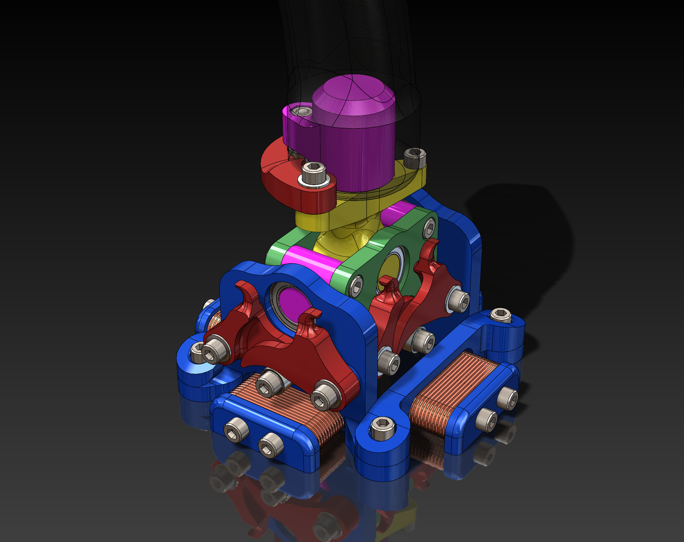

# Open Joystick

This is my attempt to make a joystick with 3d printed parts. The original design was by [olukelo](https://www.thingiverse.com/thing:2496028) but has since evolved from there.

This’ll be a 3-axis joystick where all moving parts are on bearings. It will have force feedback through the use of 4 electromagnets. There will be left and right handed version (I'm left handed so will be building it left handed and will mirror it to right).

My intent is to design and build the last joystick I’ll ever need. If it breaks I want to be able to fix it, I want it left and right handed, a twist axis, If it’s too big or too small I can resize it to fit my hand shape, force feedback, etc.

## Mechanical features
-  dual cams per axis.
- A twist axis that is also dual cam actuated.
- Force feedback using electromagnetic induction.
- All axis, and cam assemblies will be moving on ball bearings.
- Stick will have left and right variants. (I’m left handed so will be working on the left one. Right will be a mirror of the left)

## Electrical feature
- Because of the electromagnets, I don’t think hall effect angle sensors would work and will look at using potentiometers instead. 
- Microcontroller using the Arduino ecosystem.

## Software features
- Arduino based joystick implementation.

## Part list
Nuts and bolts might be able to be swapped out. You will need to get the specific bearings. I would suggest making sure to get a couple extra. I will keep an up-to-date list of parts. Keep in mind that this design is in progress so parts might change.

### Bearings
When getting bearings. I would suggest sealed ones (2rs), also Chrome steel instead of Carbon steel (they will last longer). There are many sites you can read more on bearings [like this one](https://uk.rs-online.com/web/generalDisplay.html?id=ideas-and-advice/ball-bearings-guide).

- 5x (685 Ball Bearing 5mm x 11mm x 5mm) [Amazon](https://www.amazon.ca/s?k=685+bearings)
- 5x (6802 Deep Groove Ball Bearing 15mm x 24mm x 5mm) [Amazon](https://www.amazon.ca/s?k=6802zz+deep+groove+bearings)
- 10x (MF105 bearings 5mm x 10mm x 4mm) [Amazon](https://www.amazon.ca/s?k=MF105ZZ+bearings)

## Media

### P3 | 3d printed Joystick (open joystick) - Twist axis improvements, M5 bolts
This iteration I have gotten the twist assembly in a state where I think it should work.
I have changed all the fasteners over to M5 bolts in standardized lengths. In the previous version there was some intersections with the base
Other major things improved in this version is separating the main assembly into 3 sub assemblies. This helps as the design becomes more complex.

### P2 | 3d printed Joystick (open joystick) - Twist axis, electromagnetic force feedback

The grip attaches to the upper twist assembly through 2 bearings (the big and small one). This should give enough contact for the grip to not wobble around. 

I have used the cams way of adding tension to the twist and it has added alot of bulk to the entire mechanism. Not sure if it’s entirely worth doing. The profile of the cams for the twist axis will need further adjusting as the tension doesn’t look like it’ll ramp up enough. The twist cams are meant to be tensioned by a spring that connects below.

### P1 | 3d printed Joystick (open joystick) - Gimbal design, assembly motion.
This video shows basically the full assembly of the original design by olukelo. Some minor changes were made where parts had interference with each other. Cam springs/elastic bands not visualized in this assembly.
- He has a github repo for that [project found here](https://github.com/o-devices/o-joystick-hdk) that includes STL and Solidworks source files.
- And the [Thingiverse page](https://www.thingiverse.com/thing:2496028#How%20I%20Designed%20This)
- A working 3d print of the [Olukelo's design by Slarti Bartfast](https://www.youtube.com/watch?v=H3n42BAMKc0)

