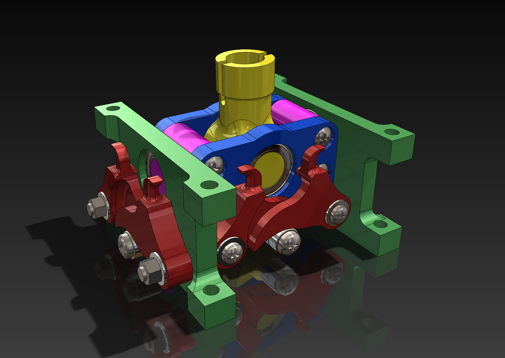

# Open Joystick

This is a 3d printed open source joystick in the works.

## Mechanical features
-  dual cams per axis.
- A twist axis that is also dual cam actuated.
- Force feedback using electromagnetic induction.
- All axis, and cam assemblies will be moving on ball bearings.
- Stick will have left and right variants. (I’m left handed so will be working on the left one. Right will be a mirror of the left)

## Electrical feature
- Because of the electromagnets, I don’t think hall effect angle sensors would work and will look at using potentiometers instead. 
- Microcontroller using the Arduino ecosystem.

## Software features
- Arduino based joystick implementation.

Below are videos on the progress of the design:

