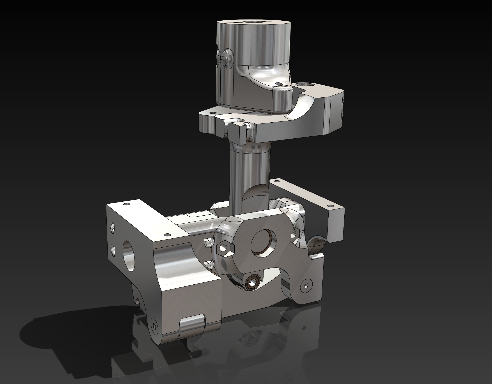
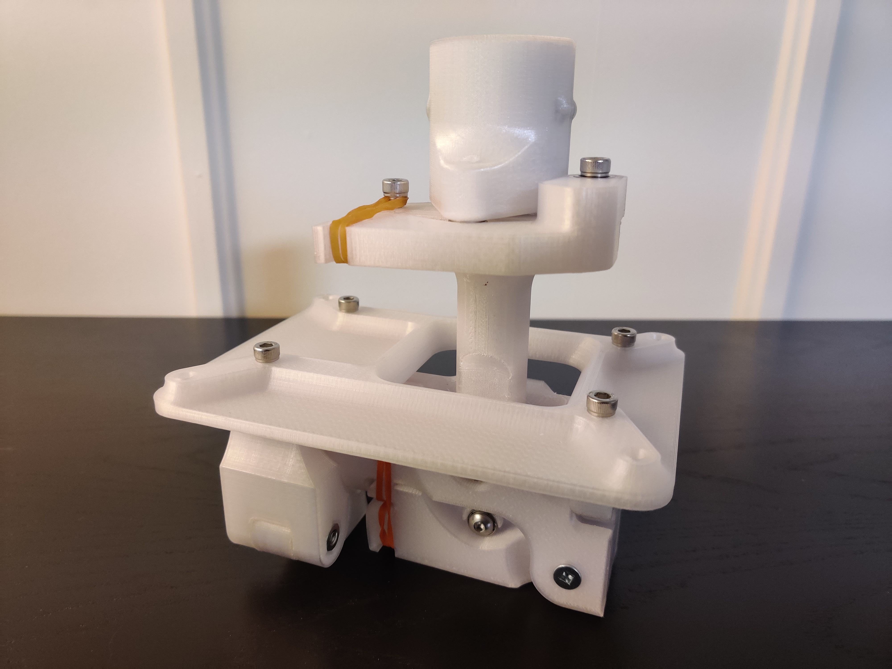

# Open Joystick

Open Joystick is an open source joystick that is built out of off the shelf components and 3d printed parts. It will feature a 3-axis gimbal base, 2-axis force feedback using brushless DC motors,  left, right handed, multiple sized grips. The plan is to build a very robust joystick that is easily customizable and serviceable that includes many features only found on very high-end ones (and some not found anywhere else). 

# Progress
This project is still in the very early stages of planning and design. Currently there is a design for 3-axis gimbals using dual cam’s on PITCH and ROLL and a single cam for YAW. Force-feedback with Coils has an initial design but not finalized. 

# [Source](source)
See the source folder for more info on build progress.

## Media
Below are progress updates from Youtube. 

